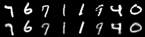
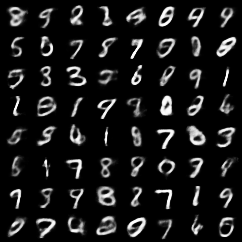
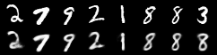
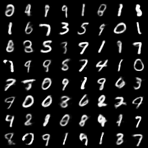
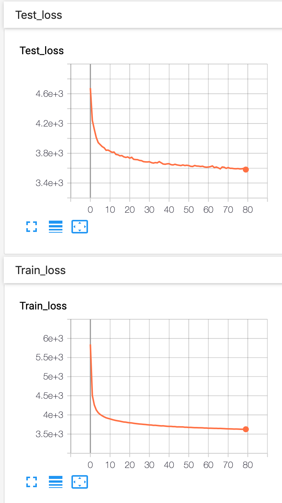

vae-mnist
====

A simple experiment to reproduce the results in Kingma's paper.
Generated results look not so bad, but sometimes it seemed to confuse between `4` and `9` or `9` and `7`.

## Results

* After **50** epochs, reconstructions and samples:

* After **100** epochs, reconstructions and samples:

* Training and Tesing losses:

